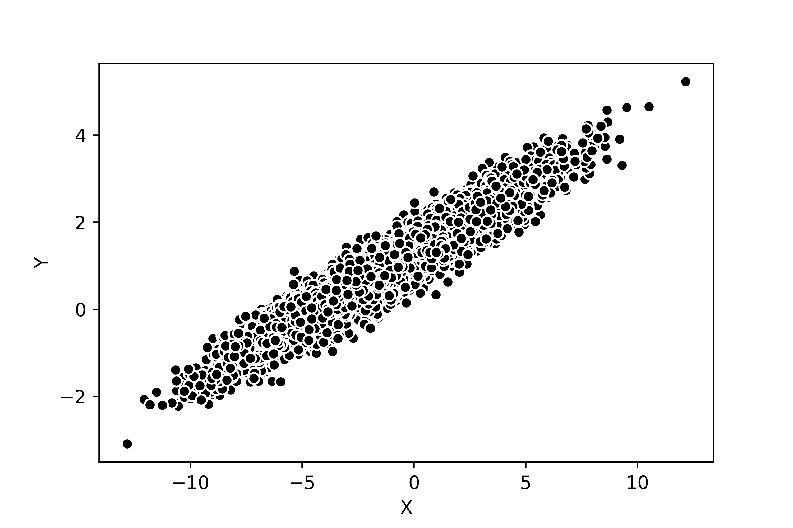
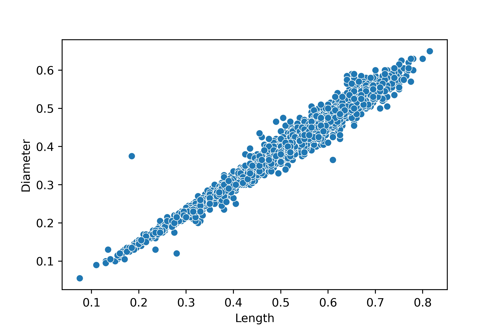
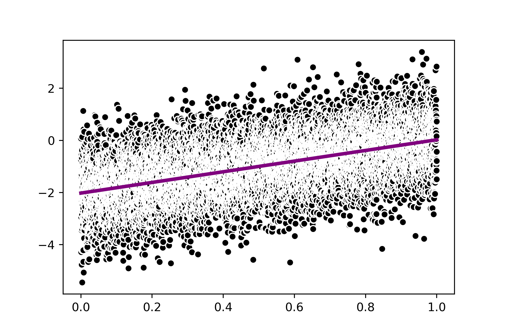
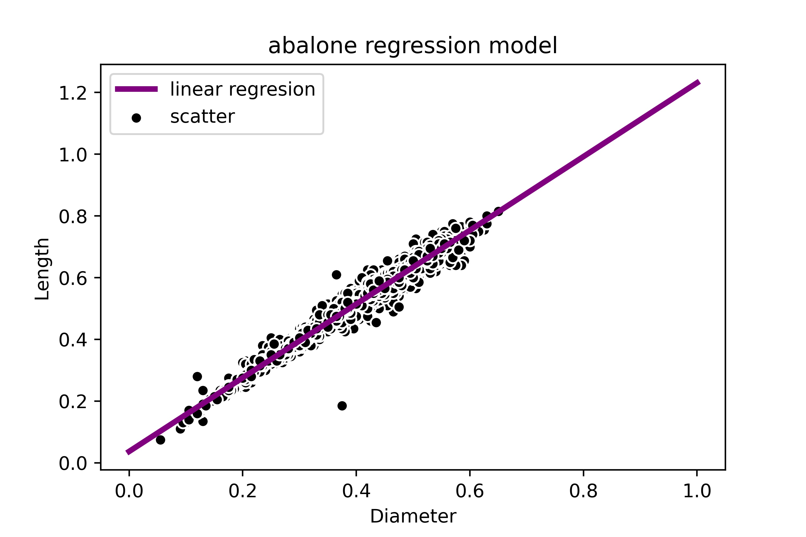

# Статистическое исследование данных abalone

## Результаты кореляционного анализа

- corr coeff: 0.9494664679963203

- real correlation: 0.9486832980505138

- diff: 0.0007831699458065167

- p-value: 0.0

- corr coeff: 0.9868115846024836

- p-value: 0.0

## Результаты регрессионого анализа

- slope: 2.0243767054704427

- intercept: -2.0185443865482906

- R_square: 0.25533339703923374

- p_value: 0.0

- std_err: 0.03457497636019418

- slope: 1.194168049239271

- intercept: 0.03691333759877169

- R_square: 0.973797103505684

- p_value: 0.0

- std_err: 0.00303163993093564

## Результаты кластерного анализа